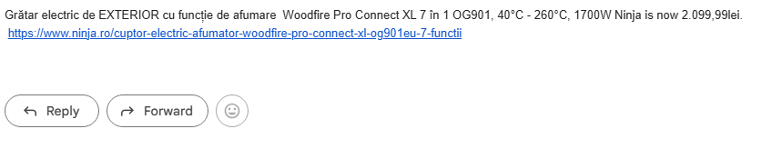

# Welcome to my **Day 47 Python Project!** 🚀  

This project is an **automated Price Tracker** that monitors the price of any product online and **notifies you via email** when it drops below a target price.  
It’s a hands-on exercise in **web scraping, data processing, and automation**.  

---

## 📸 Screenshot

Here’s a preview of the Price Tracker in action:  

  

---

## ✨ Features

- **Web Scraping** – Extract product details such as **price and name**.  
- **Text Cleaning** – Automatically formats extracted text for **clear output**.  
- **Price Alerts** – Sends an **email notification** when the price drops below your threshold.  
- **Automation & Security** – Uses **environment variables** to securely store email credentials.  

---

## 🛠️ Technologies

- **Python 3**  
- `requests` & `BeautifulSoup` for scraping  
- `dotenv` for **secure credential management**  

---

## ⚡ How It Works

1. Set the **product URL** and your desired **price threshold**.  
2. Run the script – it fetches the latest **price and product name**.  
3. Receive an **email alert** if the price falls below your threshold.  
4. The script handles **text formatting automatically**, ensuring **clean, readable messages**. 
